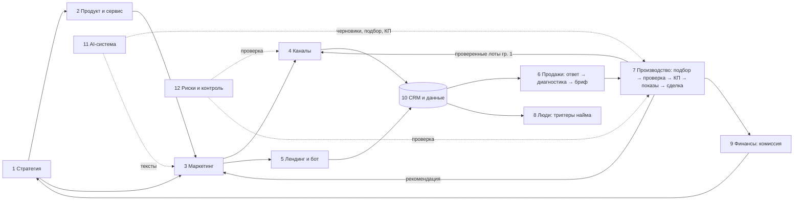

# A. Карта бизнеса «Мегаполис» на одной странице

> ОС v1.0, 26.09.2026. Интерактивная версия — вкладка «Главная» в дашборде `07_Дашборд.html`.

**Главное:** агентство зарабатывает комиссию застройщика (≈ 1 млн ₽ за сделку, оценка М) за покупателя новостройки бизнес-класса Москвы. Денежная цель №1 — первая сделка. Сейчас из 12 направлений **ни одно не закрыто полностью**: есть стратегические материалы и агенты, но нет приёма лидов, CRM, продуктовой линейки и учёта денег.

## Состояние направлений

| # | Направление | Результат | Отвечает | Делает сейчас | Сейчас | Первое действие (D) |
|---|---|---|---|---|---|---|
| 1 | Стратегия | Приоритеты и решения | М | М + архитектор | 🟡 | Решения J |
| 2 | Продукт и сервис | Понятная услуга и стандарты | М | М, CMO | ❌ | Продукты П1–П2 в работе с первого клиента |
| 3 | Маркетинг | Квалифицированные обращения | М | CMO, Рынок | 🟡 материалы есть, каналов нет | Оффер, Telegram (1.4) |
| 4 | Каналы | Поток по ролям | М | — | ❌ | Сеть, партнёры, Авито (1.1–1.6) |
| 5 | Лендинг, бот | Обращение с сайта | М | Архитектор | ❌ | Этап 2 (2.1) |
| 6 | Продажи | Лид → диагностика → работа | М | М | ❌ | CRM, сценарий, бриф (0.3, 0.7) |
| 7 | Производство | Проверенный подбор и сделка | М | Рынок, Юрист, М | 🟡 анализ рынка есть | Фиксация, быстрые выплаты (0.5, 0.6) |
| 8 | Люди | Функции закрыты вовремя | М | — | ❌ | Партнёры: юрист, ипотека (1.2, 1.3) |
| 9 | Финансы | Деньги под контролем | М | М | ❌ | Модель I, J-17 |
| 10 | Операции и данные | Одна правда | М | — | ❌ | CRM, папки, обзор по понедельникам |
| 11 | AI-система | Меньше ручной работы | М | Архитектор, Инженер | 🟡 агенты есть, связей нет | Правило «файл задачи», J-15, J-16 |
| 12 | Риски | Нет штрафов и утечек | М | Юрист | 🟡 юр. проверка работает | J-11 (закрыть репозитории) |

## Точки решения (что решает только Мария)

🔴 J-02 порог клиента · J-03 лимит теста · J-17 кассовый разрыв · J-11 закрыть репозитории · J-01 название · J-07 отказы · J-12 цель года · J-15 дублирующиеся агенты · J-18 формулировка партнёрства.

## Порядок включения ролей
Сейчас: **М + CMO + Рынок + Юрист + архитектор**, партнёры (юрист на сделку, ипотечный брокер) →
по триггерам: **Ассистент** (Т1) → **Контент-менеджер** (Т2, после первой сделки) → **Брокер-2** (Т3).
